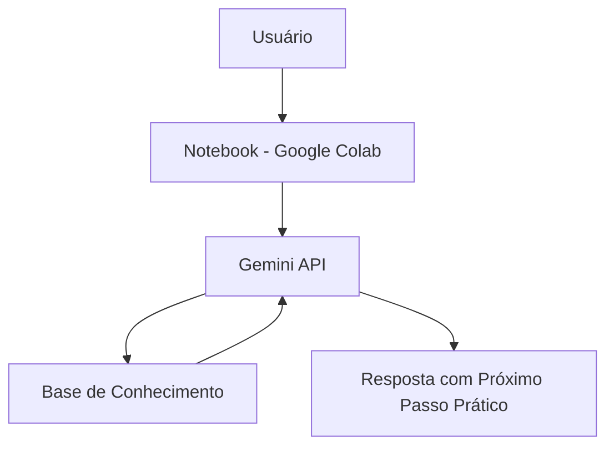

# 🧭 Data Track

> Assistente de IA Generativa que orienta estudantes e profissionais na jornada de entrada na área de dados — currículo, portfólio, entrevistas técnicas e trilha de habilidades.

## 💡 O Que é o Data Track?

O Data Track é um assistente de orientação de carreira que **ensina e orienta**, não garante vagas. Ele ajuda a estruturar currículo e portfólio, prepara para entrevistas técnicas e indica uma trilha clara de habilidades por nível, sempre terminando com um próximo passo prático.

**O que o Data Track faz:**
- ✅ Dá dicas práticas de currículo e portfólio para dados
- ✅ Ajuda a se preparar para entrevistas técnicas (SQL, Python, estatística, comportamental)
- ✅ Orienta sobre trilha de habilidades por nível (iniciante, intermediário, avançado)
- ✅ Sempre sugere um próximo passo prático

**O que o Data Track NÃO faz:**
- ❌ Não garante vagas nem faz encaminhamento para empresas
- ❌ Não substitui mentoria profissional aprofundada
- ❌ Não inventa informações fora da sua base de conhecimento

## 🏗️ Arquitetura



**Stack:**
- Interface: Notebook (Google Colab / Jupyter)
- LLM: Gemini API (`gemini-3.5-flash`, camada gratuita)
- Dados: Markdown estruturado

## 📁 Estrutura do Projeto

```
├── data/
│   └── base_conhecimento.md       # Currículo, entrevistas e trilha de habilidades
│
├── docs/
│   ├── 01-documentacao-agente.md  # Caso de uso e persona
│   ├── 02-base-conhecimento.md    # Estratégia de dados
│   ├── 03-prompts.md              # System prompt e exemplos
│   ├── 04-metricas.md             # Avaliação de qualidade
│   └── 05-pitch.md                # Apresentação do projeto
│
└── src/
    └── data_track.ipynb           # Aplicação (notebook)
```

## 🚀 Como Executar

### 1. Obter a chave de API do Gemini
Acesse [aistudio.google.com/apikey](https://aistudio.google.com/apikey), faça login com sua conta Google e crie uma chave gratuita.

### 2. Instalar dependência

```
pip install google-generativeai
```

### 3. Rodar o Data Track
Abra `src/data_track.ipynb` no Google Colab, cole sua chave de API na célula indicada e execute as células em ordem.

## 🎯 Exemplo de Uso

**Pergunta:** "Como me portar em uma entrevista?"
**Data Track:** "Entrevista na área de dados dá um frio na barriga, mas o segredo para se portar bem é demonstrar uma linha de raciocínio clara e estruturada... Próximo passo prático: escolha um projeto do seu portfólio hoje e treine explicá-lo em voz alta em até 2 minutos."

**Pergunta:** "Sou iniciante, o que devo aprender primeiro?"
**Data Track:** "Começar na área de dados é empolgante, mas o segredo para não se perder é focar na base... Próximo passo prático: baixe um banco de dados gratuito e tente instalar o MySQL ou PostgreSQL para praticar os primeiros comandos de SQL."

## 📊 Métricas de Avaliação

| Métrica | Objetivo |
|---|---|
| **Relevância** | O agente responde o que foi perguntado? |
| **Aderência ao escopo** | Evita inventar informações fora do tema (anti-alucinação)? |
| **Clareza** | A resposta é fácil de entender e bem estruturada? |
| **Tom** | Soa acolhedor e motivador, como planejado? |

## 🎬 Diferenciais

- **Foco em próximo passo:** toda resposta termina com uma ação prática
- **Simples e local:** roda em um notebook, sem infraestrutura complexa
- **Seguro:** reconhece os limites do próprio escopo em vez de inventar respostas

## 📝 Documentação Completa

Toda a documentação técnica, estratégia de prompt e casos de teste estão disponíveis na pasta [`docs/`](./docs).
